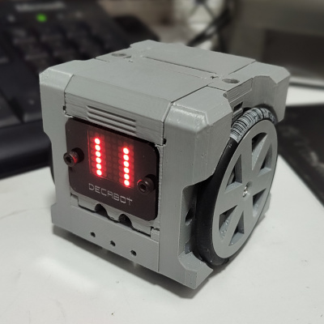
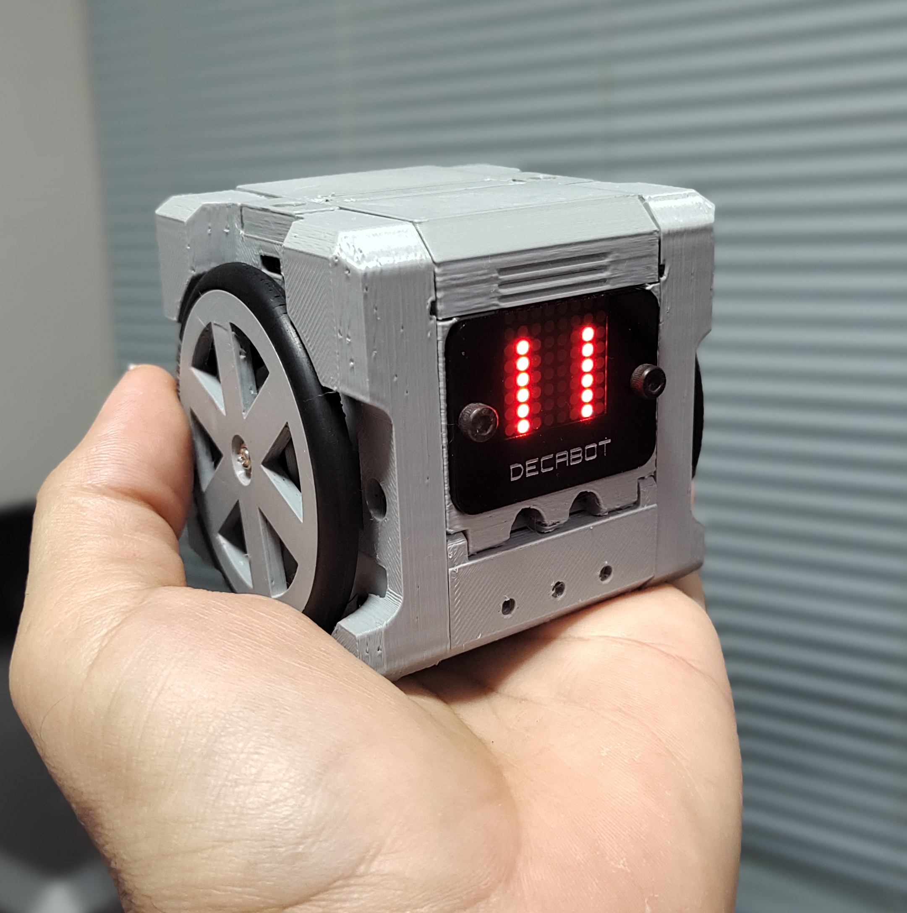
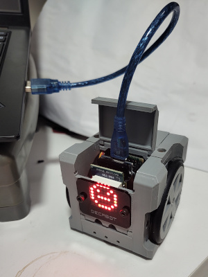
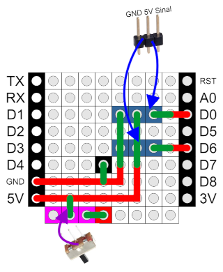
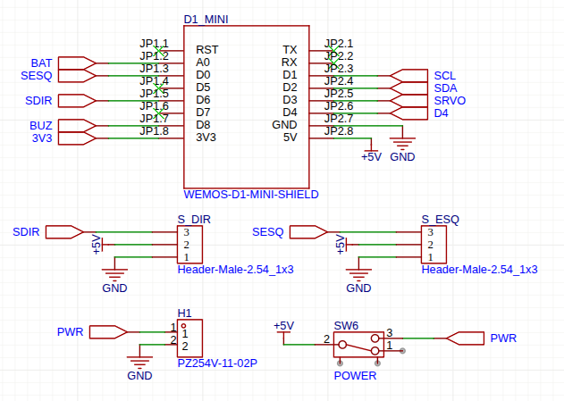
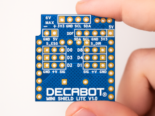
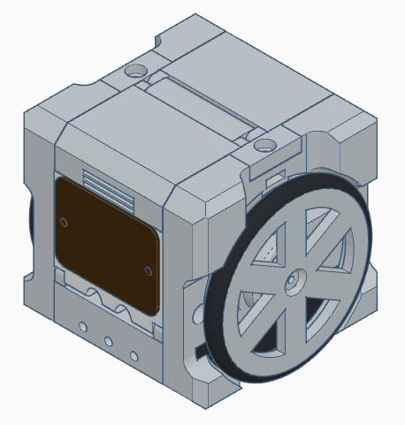

# openDecabot
The easiest 3D printed robot you can assemble and program using Wemos D1 Mini Shields and Arduino IDE, powered by ESP8266. 

## Hardware
### ESP8266 microcontroler
Open Decabot® uses the ESP8266 controler, in the Wemos Mini form factor, wich allows to use small shields to expand its capacities. In the simplest version, this robot uses a LED matrix shield and a custom connection shield, besides the Wemos D1 mini. The custom shield can be build with a PCB perfboard, a few pin header connections, and some soldering skills. 

By using the Espressif ESP8266 platform, the open Decabot® is nativelly equiped with Wi-Fi capabilities, allowing great IoT experiences, such as remote control and telemetry. 

More information about Wemos platform and a list of main shields available can be found on www.wemos.cc .

### Servo Motors
The open Decabot® robot uses two 360 servo motors to drive its wheels. It's the simplest solution for small robots, since the servo motors didin't require H bridge circuits (they already have those inside!) and can be connected directly to the ESP8266 pins. 

### 3D printed body
You can assemble your Open Decabot® using 3D printed parts. The basic chassis uses only 8 3D printed pieces, and can be assembled using a few screws. The 3D files can be found on **3dPrint** folder. 

### Simple AA batteries for power
Under the open Decabot® you can find a 4 x AA battery support, who can supply up to 6V directly to ESP board. This option simplifies the hardware, since the Wemos Mini board can hold the maxminum 6 volts, lowering the tension to 3 volts. Users can hack the project to use LiIon batteries, combined with the Wemos LiPo Battery Shield (https://www.wemos.cc/en/latest/d1_mini_shield/battery.html) for charging and step up the voltage to 5 volts. 

### Easy access to USB ports
There are two ports on the upper part of the robot who can be used to access the USB port (for firmware/Arduino sketch update), and other wiring and shield needs. 

### Bill of Materials - BOM
- 1 x Wemos D1 Mini ESP8266 controller
- 2 x Servo 5V 360
- 1 x Wemos LED Matrix Shield
- 1 x custom PCB board (check wiki how to build one) or 1 x Decabot Mini Shield PCB (see **/decabotMiniShield** folder)
- 1 x battery support for 4 x AA
- 1 x acrylic frontface + 2 hallen 3mm screws (optional)
- 7 x screws 3mm, 12mm long
- 2 x rubber o-ring for wheels, size 2" or 50mm (ref: DN50)
- 4 x AA batteries

### Decabot Mini Shield

#### Homemade PDB
Wemos platform does not have a simple shield board to connect servos, so you need a homemade board to use. It's goal is just to simplify the connection between the controller and the motors. A homemade PDB board can be assembled just to connect the main components to the Wemos board: Battery to 5V pin, and servos to D0 and D6 pins, as shown below:

#### Buy the Decabot Shield

Help funding this project by buying our dedicated shield. It is the easiest way to enjoy all the possibilities of your Open Decabot Robot!

- Easy access to Servo connections
- On-off switch
- Included buzzer for sounds
- Easy connection for extra sensors, such as line-folowing sensors
- Dedicated connection to Gyroscope/Accelerometer, for mapping projects
- Dedicated connection to I2C modules, such as OLED displays, distance sensors, RGB sensors and RFID/NFC sensors

More information about commercial partnership on WIKI soon.

## Arduino Codes

The Arduino sketches can be found on **/ArduinoSketch** folder. You can simply copy this folder inside your Arduino folder on your computer, and open the `.ino` files. 

Remember that Decabot platform is based on `ESP8266` chip, in Wemos D1 Mini form factor. Your Arduino IDE must be proper set to manage ESP8266 family. To se if it is ready, go to `Tools` menu, then `Boards`, and look for `ESP8266 boards`. You must find `Wemos D1 Mini` there. If not, google for _installing ESP8266 on Arduino IDE_.

Some sketches uses libraries who must be installed before. See instructions on each sketch how to proceed. 

## 3D project source
The 3D source project was all designed on Tinkercad (yes!), and can be forked using the link below:
https://www.tinkercad.com/things/dYy4XWihfYu-opendecabot-mini-v10

## Decabot® Trade Mark
Besides this project is open source, the Decabot® name is a registered trademark from Decano Kits Company, and should not be used without proper consent. 

## Open Source Licenses

Open Decabot® project is licensed under CC BY-NC-SA 4.0. You are free to:

- Share — copy and redistribute the material in any medium or format
- Adapt — remix, transform, and build upon the material

Under the following terms:

- Attribution — You must give appropriate credit , provide a link to the license, and indicate if changes were made . You may do so in any reasonable manner, but not in any way that suggests the licensor endorses you or your use.
- NonCommercial — You may not use the material for commercial purposes .
- ShareAlike — If you remix, transform, or build upon the material, you must distribute your contributions under the same license as the original.

https://creativecommons.org/licenses/by-nc-sa/4.0/

