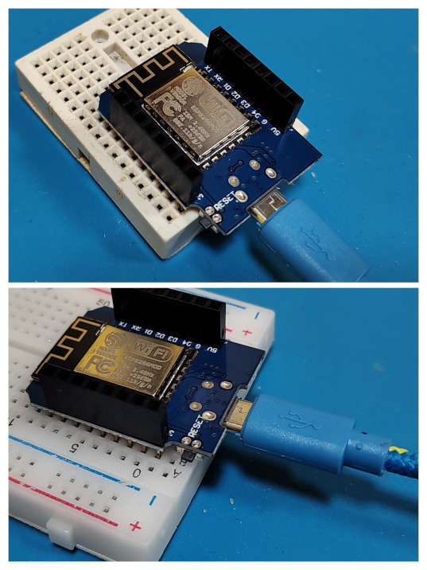

# Semáforo Simples com Wemos D1 Mini

Bem-vindos a mais uma prática do laboratório Lapin. Após aprendermos a piscar o LED interno, vamos expandir nossos conhecimentos para o mundo físico externo utilizando uma protoboard e múltiplos componentes. Neste tutorial, vamos criar um sistema de semáforo clássico.

## 1. Objetivos da Aula

* Entender o funcionamento de múltiplas saídas digitais em sequência.

* Aprender a montar um circuito básico em uma protoboard utilizando componentes externos.

* Programar a lógica de tempo e transição de estados de um semáforo (Verde, Amarelo e Vermelho) na plataforma Wemos D1 Mini (ESP8266).
  
  ## 2. Materiais Necessários

* 1x Placa Wemos D1 Mini (ESP8266)

* 1x Cabo Micro-USB

* 1x Protoboard (Matriz de contatos)

* 3x LEDs de 5mm (1 Vermelho, 1 Amarelo, 1 Verde)

* Fios Jumper (Macho-Macho ou Macho-Fêmea, dependendo de como os pinos da sua placa estão soldados)
  
  > **⚠️ Nota importante sobre Resistores e LEDs:** > O ideal e correto na eletrônica é sempre utilizar resistores (ex: 220Ω ou 330Ω) em série com cada LED. Eles servem para limitar a corrente e evitar que o LED sofra danos. No entanto, para esta prática de laboratório rápida e simples, se você ligar os LEDs diretamente aos pinos digitais do Wemos D1 Mini, eles não irão queimar de imediato. Isso ocorre porque a tensão lógica do ESP8266 é de 3.3V (menor que os típicos 5V do Arduino Uno) e a corrente dos pinos é naturalmente limitada. Apesar disso funcionar para o nosso teste de hoje, lembre-se: em projetos definitivos, como no Decabot, o uso de resistores é indispensável!
  
  ## 3. Montagem do Circuito
1. Conecte a placa Wemos D1 Mini à protoboard, de forma que os pinos estejam acessíveis e que seja possível conectar o cabo USB (veja imagem).
   

2. Conecte um fio do pino **GND** do Wemos D1 Mini à linha azul (negativa) da protoboard.

3. Insira os 3 LEDs na protoboard. Lembre-se que o pino mais longo do LED é o positivo (Ânodo) e o mais curto, ou o lado com um corte reto na borda de plástico, é o negativo (Cátodo).

4. Conecte os pinos curtos (Cátodos) de todos os LEDs à linha negativa da protoboard.

5. Conecte os pinos longos (Ânodos) aos pinos digitais do Wemos da seguinte forma:
   
   * **LED Vermelho:** Pino **D1**
   
   * **LED Amarelo:** Pino **D2**
   
   * **LED Verde:** Pino **D3**
     
     ## 4. Preparando a Arduino IDE
* Abra a Arduino IDE e certifique-se de que a placa **LOLIN(WEMOS) D1 R2 & mini** está selecionada em **Ferramentas > Placa**.

* Verifique se a porta de comunicação correta (COM no Windows ou /dev/ttyUSB no Mac/Linux) está selecionada em **Ferramentas > Porta**.
  
  ## 5. O Código-Fonte (Sketch)
  
  Copie o código abaixo para a sua IDE. Diferente do nosso primeiro exercício, estes LEDs externos acenderão com nível lógico alto (HIGH).
  
  ```cpp
  /*
  Laboratório Lapin - Prática de Semáforo
  Projeto: Controle de 3 LEDs com Wemos D1 Mini
  */
  // Definição dos pinos
  const int ledVermelho = D1;
  const int ledAmarelo = D2;
  const int ledVerde = D3;
  void setup() {
  // Configura os 3 pinos como saída (OUTPUT)
  pinMode(ledVermelho, OUTPUT);
  pinMode(ledAmarelo, OUTPUT);
  pinMode(ledVerde, OUTPUT);
  }
  void loop() {
  // --- FASE 1: SINAL VERDE ---
  digitalWrite(ledVermelho, LOW);
  digitalWrite(ledAmarelo, LOW);
  digitalWrite(ledVerde, HIGH); // Liga o Verde
  delay(5000); // Mantém por 5 segundos
  
  // --- FASE 2: SINAL AMARELO ---
  digitalWrite(ledVerde, LOW); // Desliga o Verde
  digitalWrite(ledAmarelo, HIGH); // Liga o Amarelo
  delay(2000); // Mantém por 2 segundos
  
  // --- FASE 3: SINAL VERMELHO ---
  digitalWrite(ledAmarelo, LOW); // Desliga o Amarelo
  digitalWrite(ledVermelho, HIGH); // Liga o Vermelho
  delay(5000); // Mantém por 5 segundos
  }
  ```
  
  ## 6. Compilando e Carregando
1. Clique em **Verificar** (ícone do V) para compilar o código e buscar possíveis erros de digitação.

2. Clique em **Carregar** (ícone da seta) para transferir o código para o seu microcontrolador.

3. Aguarde a mensagem "Transferência Concluída". Seu circuito na protoboard já deve estar funcionando, alternando entre Verde, Amarelo e Vermelho no tempo programado!
   
   ## 7. Desafio Prático
   
   Para aprimorar suas habilidades em sistemas embarcados, tente resolver os seguintes problemas alterando o código:

4. **Semáforo de Madrugada:** Crie uma lógica onde, ao invés de ciclar entre as três cores, apenas o LED amarelo pisca continuamente a cada 1 segundo (muito comum nas ruas durante a madrugada).

5. **Semáforo de Pedestres (Avançado):** Adicione mais dois LEDs à protoboard (um Verde e um Vermelho). Programe-os para que o sinal do pedestre só fique Verde enquanto o semáforo dos carros estiver Vermelho.
