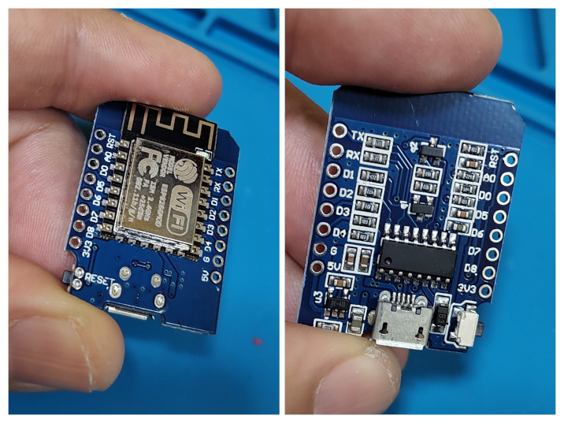
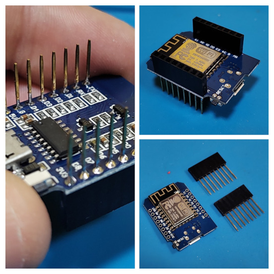

# Introdução: Plataforma Wemos D1 Mini



A plataforma **Wemos D1 Mini** é uma das placas de desenvolvimento mais populares e eficientes do ecossistema de Internet das Coisas (IoT) e sistemas embarcados. Baseada no módulo Wi-Fi **ESP8266EX**, ela combina um tamanho extremamente reduzido (form factor *mini*) com um poder de processamento e conectividade robustos, tornando-se uma ferramenta indispensável tanto para o ensino acadêmico quanto para o desenvolvimento de protótipos avançados de robótica open-source e automação.

## 1. Características Técnicas

O Wemos D1 Mini supera as placas tradicionais de 8 bits (como o Arduino Uno) em quase todas as métricas de desempenho, operando com uma arquitetura de 32 bits e conectividade sem fio nativa.

* **Microcontrolador:** ESP-8266EX (Processador RISC de 32 bits Tensilica L106)
* **Tensão de Operação:** 3.3V (Atenção: as entradas não são tolerantes a 5V de forma direta)
* **Tensão de Entrada (USB/Pino 5V):** 4.75V a 10V (possui regulador interno para 3.3V)
* **Velocidade de Clock:** 80 MHz (podendo ser configurado até 160 MHz)
* **Memória Flash:** 4 Megabytes (32 Megabits) para armazenamento de código e sistema de arquivos (SPIFFS/LittleFS)
* **SRAM:** Cerca de 50 KB disponíveis para o usuário
* **Conectividade:** Wi-Fi integrado 802.11 b/g/n com antena embutida na PCB
* **Pinos de Entrada/Saída Digital (GPIO):** 11 pinos, todos com suporte a Interrupção, PWM, I2C e One-Wire (exceto o pino D0)
* **Pino de Entrada Analógica (ADC):** 1 entrada (A0) com resolução de 10 bits (tensão máxima de entrada de 3.2V devido ao divisor resistivo interno da placa; o chip puramente aceita até 1V)
* **Interface USB:** Conversor USB-Serial integrado (geralmente CH340 ou CP2104) com conector Micro-USB

---

## 2. Pinagem (Pinout) e Funções Especiais

Ao montar sua Wemos D1 mini lembre-se de escolher corretamente o pino duplo, posicionando para cima os pinos fêmeas, e na parte de baixo os pinos machos, conforme imagem:



Compreender a pinagem do Wemos D1 Mini é fundamental, pois os rótulos gravados na placa (D0 a D8) não correspondem diretamente aos números das portas lógicas (GPIO) internos usados na programação.
| Rótulo na Placa | GPIO Interno | Funções Principais / Notas de Boot |
| :--- | :--- | :--- |
| **TX** | GPIO 1 | Transmissão Serial (U0TXD). Pisca no boot. |
| **RX** | GPIO 3 | Recepção Serial (U0RXD). Alto no boot. |
| **D0** | GPIO 16 | Wake do modo Deep Sleep. Sem suporte a PWM/Interrupção. |
| **D1** | GPIO 5 | **SCL** (I2C por hardware / padrão). |
| **D2** | GPIO 4 | **SDA** (I2C por hardware / padrão). |
| **D3** | GPIO 0 | Conectado a um resistor de Pull-up interno. **Deve estar em nível ALTO no boot** para entrar no modo de execução. |
| **D4** | GPIO 2 | Conectado ao **LED Azul Integrado** (lógica invertida: LOW liga, HIGH desliga). Emite dados de debug no boot. |
| **D5** | GPIO 14 | **CLK** (SPI por hardware). |
| **D6** | GPIO 12 | **MISO** (SPI por hardware). |
| **D7** | GPIO 13 | **MOSI** (SPI por hardware). |
| **D8** | GPIO 15 | **CS** (SPI por hardware). Conectado a um resistor de Pull-down interno. **Deve estar em nível BAIXO no boot**. |
| **A0** | ADC0 | Entrada Analógica (0V a 3.2V). |
| **RST** | RST | Pino de Reset da placa (Ativo em nível BAIXO). |
| **5V** | — | Saída de 5V (quando alimentado por USB) ou Entrada de Alimentação Externa. |
| **3V3** | — | Saída do regulador interno de 3.3V (máximo ~500mA). |
| **GND** | — | Referência de aterramento (Ground). |

---

## 3. Vantagens do Uso de Shields Wemos D1 Mini

Uma das maiores forças desta plataforma é o seu ecossistema de **Shields** (placas de expansão modulares). Elas eliminam a necessidade de fiação complexa e trazem vantagens significativas:

* **Prototipagem Rápida e Limpa:** As shields possuem exatamente o mesmo tamanho e disposição de pinos da placa principal. Elas podem ser empilhadas diretamente usando barras de pinos macho-fêmea, eliminando emaranhados de cabos jumpers e o uso excessivo de protoboards.
* **Redução de Pontos de Falha:** Mau contato em fios jumpers é um dos problemas mais comuns em projetos laboratoriais e robóticos móveis. A conexão soldada das shields garante integridade mecânica e elétrica.
* **Compactação do Projeto:** Permite criar dispositivos IoT completos (com sensores, displays e atuadores) que cabem dentro de pequenas caixas ou estruturas robóticas compactas.
* **Variedade de Recursos Prontos:** Existem dezenas de shields oficiais e compatíveis no mercado, tais como:
  * *Relay Shield:* Para controle de cargas de alta tensão (lâmpadas, motores).
  * *OLED Shield:* Telas compactas de 64x48 ou 128x64 pixels para interface visual.
  * *DHT11/DHT22 Shield:* Sensores de temperatura e umidade prontos para leitura.
  * *Battery Shield:* Circuito integrado para carregar e gerenciar baterias de Lítio (LiPo) de 3.7V, ideal para robôs móveis.
  * *MicroSD Card Shield:* Para datalogging (registro de dados locais).

Conheça todas as shield disponíveis acessando o site wemos em www.wemos.cc .

---

## 4. Tutorial: Configurando a Arduino IDE para o Wemos D1 Mini

Para programar o Wemos D1 Mini usando a linguagem baseada em C/C++ do Arduino, siga os passos abaixo:

### Passo 1: Adicionar a URL do ESP8266 nas Preferências

1. Abra a **Arduino IDE**.

2. No menu superior, clique em **Arquivo** > **Preferências** (no macOS: *Arduino IDE* > *Settings*).

3. Localize o campo chamado **URLs Adicionais para Gerenciadores de Placas**.

4. Cole a seguinte URL exatamente como descrita:
   
   ```text
   http://arduino.esp8266.com/stable/package_esp8266com_index.json
   ```

5. Clique em **OK** para salvar.
   
   ### Passo 2: Instalar o Pacote de Placas ESP8266

6. No menu lateral esquerdo da Arduino IDE, clique no ícone do **Gerenciador de Placas** (ou vá em *Ferramentas* > *Placa* > *Gerenciador de Placas...*).

7. Na barra de pesquisa que aparecer, digite **esp8266**.

8. Localize o pacote chamado **esp8266** criado pela *ESP8266 Community*.

9. Clique no botão **Instalar** e aguarde o término do download e configuração (isso pode levar alguns minutos).
   
   ### Passo 3: Selecionar a Placa Correta

10. Vá no menu superior em **Ferramentas** > **Placa** > **ESP8266 Boards**.

11. Procure e selecione a opção **LOLIN(WEMOS) D1 R2 & mini**.
    
    ### Passo 4: Instalar os Drivers e Conectar a Placa

12. Conecte o Wemos D1 Mini ao computador através de um cabo Micro-USB (certifique-se de que o cabo suporta transferência de dados, e não apenas energia).

13. Se a sua placa utilizar o chip de comunicação **CH340** e o seu sistema operacional não o reconhecer automaticamente, faça o download e a instalação do driver *CH340 Serials Driver* (disponível para Windows, Mac e Linux).

14. Na Arduino IDE, vá em **Ferramentas** > **Porta** e selecione a porta correspondente (ex: `COM3`, `COM4` no Windows, ou `/dev/tty.usbserial` no Unix).
    
    ### Passo 5: Teste Prático (Blink)
    
    Para validar se tudo está funcionando, carregue o código de teste padrão que pisca o LED embutido utilizando a constante correta da placa:
    
    ```cpp
    void setup() {
    // Configura o pino do LED interno como saída
    pinMode(LED_BUILTIN, OUTPUT); 
    }
    void loop() {
    // Liga o LED (Lógica invertida: LOW ativa o LED interno no Wemos)
    digitalWrite(LED_BUILTIN, LOW); 
    delay(5000); // Mantém ligado por 5 segundos
    
    // Desliga o LED
    digitalWrite(LED_BUILTIN, HIGH); 
    delay(1000); // Mantém desligado por 1 segundo
    }
    ```
